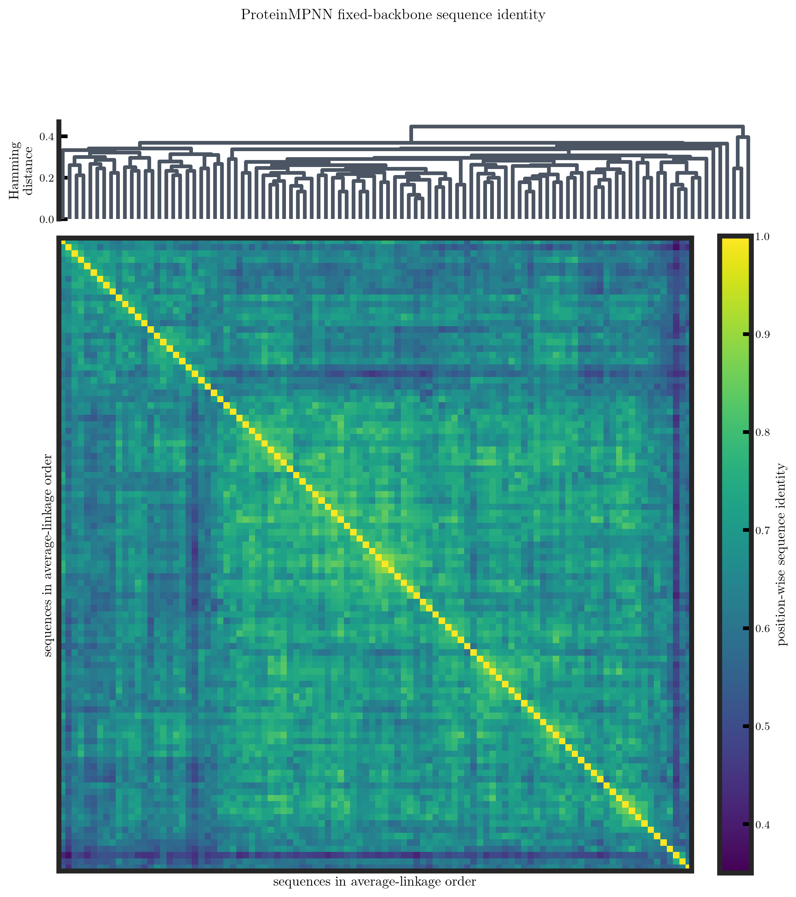
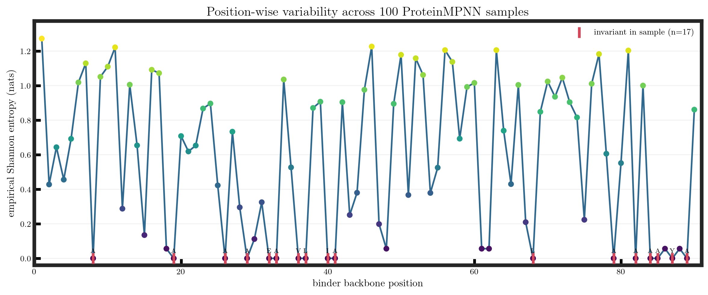

# exp006 generation audit

ProteinMPNN generated 100 sequences for chain B of the fixed RFdiffusion
seed-42 insulin-receptor complex. Chain A and all backbone coordinates were
held fixed. Generation used checkpoint v_48_020, temperature 0.1, zero
backbone noise, ten prespecified batch seeds, and CPU-only PyTorch 2.5.1.

## Engineering result

| Check | Result |
|---|---:|
| Successful batches | 10/10 |
| Sampled sequences | 100 |
| Sequence length | 90 residues |
| Unique sequences in sample | 100 |
| Probability archives | 10 |
| Score archives | 10 |
| Total generation time | 162.899 s |
| Peak batch resident memory | 658,016 KiB |
| ProteinMPNN GPU use | none |

The interrupted PyTorch 1.9.1 attempt generated no sequences and is preserved
under the run directory with an explicit interrupted status. It is not included
in this ensemble.

## Preliminary ensemble descriptors

| Quantity | Minimum | Median | Maximum |
|---|---:|---:|---:|
| Designed-chain ProteinMPNN score | 0.7159 | 0.8110 | 0.9584 |
| Pairwise sequence identity | 37.8% | 66.7% | 90.0% |
| Empirical position entropy (nats) | 0.000 | 0.648 | 1.273 |

Seventeen of 90 positions were invariant in the 100 samples. Ala, Glu, and Lys
account for 72.1% of all sampled residues. These numbers describe this finite
ProteinMPNN sample at one temperature and one fixed backbone. They do not
measure evolutionary conservation, folding, binding affinity, specificity, or
experimental success.

## Identity and clustering

Identity is the fraction of equal amino acids at corresponding positions on the
shared 90-residue backbone. Average-linkage clustering uses distance equal to
one minus identity.

| Identity-associated dendrogram cut | Clusters | Largest cluster |
|---:|---:|---:|
| 50% | 1 | 100 |
| 60% | 2 | 97 |
| 70% | 15 | 57 |
| 80% | 71 | 5 |
| 90% | 99 | 2 |

The large threshold dependence does not support one natural cluster count. A
70% cut can serve as an operational diversity rule, but the resulting 15
clusters should not be described as biological sequence families. Because this
is average linkage, a displayed cut does not guarantee that every pair inside a
cluster exceeds that identity.

## Position-wise entropy

The plug-in Shannon entropy was calculated from the 100 sampled residue
frequencies at each backbone position. No finite-sample bias correction was
applied.

Invariant positions are 8, 19, 26, 29, 32, 33, 36, 37, 40, 41, 68, 79, 82,
84, 85, 87, and 89. The six highest-entropy positions are 1, 46, 11, 56, 63,
and 81.

The entropy values are also mapped to the unchanged RFdiffusion coordinates in
the rotatable [backbone entropy view](entropy_backbone.html). The gray trace is
the fixed receptor and the entropy-colored trace is the chain-B Cα backbone.
The visualization omits side chains because RFdiffusion has not assigned or
packed them at this stage. It uses the original Cartesian coordinate frame and
does not optimize or rotate stored coordinates.

## Reproducible outputs

- pairwise_identity.csv: exact 100 × 100 identity matrix
- sequence_clusters.csv: dendrogram order and cluster assignments over five
  cuts
- position_entropy.csv: consensus identities, frequencies, entropy and the
  full 20-amino-acid frequency table
- sequence_analysis_summary.json: method definitions and compact results
- entropy_backbone.html: rotatable real-coordinate mapping

All outputs are regenerated with:

    PYTHONPATH=src /home/yusheng/anaconda3/bin/python \
      scripts/analyze_proteinmpnn_sequence_ensemble.py

## Next decision

Before choosing candidates, define and review the analysis policy for:

1. provisional interface versus non-interface positions;
2. cluster-aware representative selection;
3. composition and developability flags;
4. independent all-atom complex prediction and physical interface scoring.

Raw outputs and the canonical sequences.csv table remain under the ignored run
directory:

    runs/exp006_proteinmpnn_fixed_backbone_ensemble/
    └── proteinmpnn/fixed_backbone_cpu/
