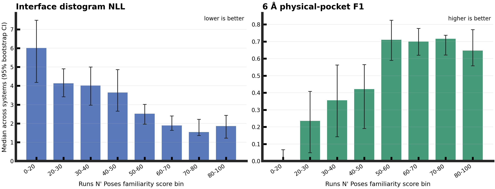
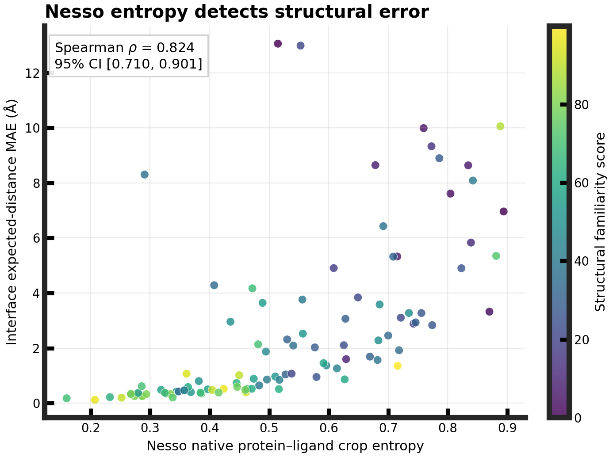

# Nesso-1 structural generalization across Runs N' Poses familiarity

## Result

Nesso-1 completed all **100/100** frozen systems with no inference or final
scoring failures. Its coordinate-free structural predictions depend strongly
on similarity to protein pockets and ligand poses available before the model's
September 2021 structural-training cutoff.

| Metric | Overall median | Spearman rho vs familiarity | Cluster-bootstrap 95% CI |
| --- | ---: | ---: | ---: |
| Interface distogram NLL (lower is better) | 2.936 | -0.704 | [-0.796, -0.577] |
| Interface expected-distance MAE (A; lower is better) | 1.311 | -0.709 | [-0.814, -0.584] |
| 6 A token-contact average precision | 0.740 | +0.682 | [+0.543, +0.787] |
| 6 A token-contact AUROC | 0.996 | +0.662 | [+0.519, +0.763] |
| 6 A physical-pocket F1 | 0.526 | +0.647 | [+0.503, +0.760] |

The contrast is large. Median distogram NLL falls from 6.009 in the 0--20
familiarity bin to 1.546 in the 70--80 bin. Median physical-pocket F1 rises
from 0.000 to 0.717 over the same comparison. The 80--100 bin is slightly worse
than 70--80 on these two medians, so the binned pattern is not strictly
monotonic, but the continuous trends are strong.

## Uncertainty is useful

Nesso's native protein--ligand crop entropy tracks its structural error.
Spearman rho is **+0.824** (95% bootstrap CI [+0.707, +0.903]) between entropy
and interface expected-distance MAE, and +0.747 ([+0.599, +0.847]) between
entropy and distogram NLL. This suggests entropy can flag many unreliable
representations even when experimental coordinates are unavailable.

As an exploratory check, the entropy--MAE relationship remains after
rank-controlling structural familiarity (partial rho +0.671; 95% CI [+0.447,
+0.826]) and after additionally controlling protein and ligand size (+0.645;
[+0.412, +0.807]). Entropy is therefore not merely reproducing the familiarity
score in this pilot, although this post-primary analysis needs confirmation.

## What was evaluated

Nesso received only the exact deposited protein sequence and ligand SMILES.
Experimental coordinates were withheld until scoring. The primary metric is
categorical negative log likelihood for resolved protein-token--ligand-atom
pairs within a true 15 A interface. Protein tokens use C-beta coordinates
(C-alpha for glycine); ligand heavy atoms are individual tokens.
The saved full-system map contains refined predictions inside Nesso's selected
crop and the initial global predictions elsewhere; all true interface pairs
are scored, including a true pocket missed by the crop.

Two 6 A evaluations are kept separate:

- token contacts compare C-beta/C-alpha--ligand distances and test the native
  distogram representation;
- physical pocket recovery labels a residue positive if any protein heavy atom
  is within 6 A of the ligand, matching the Runs N' Poses annotation.

The released native Nesso affinity mask uses a 15 A cutoff and is not presented
as a 6 A prediction. Exact ligand graph symmetries are handled by minimizing
interface NLL over the allowed isomorphisms. Full definitions and rationale are
in [Decision 0002](../../docs/decisions/0002-nesso-rnp-coordinate-free-structural-metrics.md).

## Execution and reproducibility

- Nesso version/checkpoint revision: `v1.0.0`
- pinned source, environment, checkpoint, CCD, and ESM checksums:
  [configs/models/nesso1.yaml](../../configs/models/nesso1.yaml)
- seed: 42; five recycling steps; bfloat16 mixed precision
- pocket refinement: 22 A initial cutoff, 256-token budget
- hardware: NVIDIA GeForce RTX 3080, 10,240 MiB
- inference stage shown by Nesso: 11:02 for 100 systems
- end-to-end warm-cache wrapper time: 808.6 s
- peak total GPU allocation observed by the wrapper: 9,603 MiB
- raw predictions: 3.7 GB under ignored `runs/`; not committed
- final compact table: [per_system_metrics.csv](results/per_system_metrics.csv)
- aggregate metrics, exact command, and run provenance: [summary.json](results/summary.json)

The exact scoring command is recorded in the
[experiment definition](../../experiments/exp012_nesso1_rnp_distogram_generalization/experiment.yaml).

The first scoring pass flagged four SMILES containing explicit hydrogens used
only to define imine stereochemistry. Nesso skips those hydrogen tokens. The
mapper was corrected and covered by a focused test; the final 100-system table
has no missing records.

## Interpretation limits

This result is consistent with strong structural-familiarity dependence, but
it does not by itself prove that Nesso memorizes individual training complexes.
Familiarity can covary with intrinsic target and ligand difficulty. The pilot
is diversity-stratified rather than representative of the PDB distribution,
contains only 12--13 systems per bin, and has no independent model baseline.
It also cannot evaluate affinity accuracy because Runs N' Poses does not supply
systematic experimental affinity labels. A follow-up should compare at least
one coordinate-generating model on the identical frozen systems and model
performance jointly against familiarity, protein length, ligand size, and
experimental structure quality.
