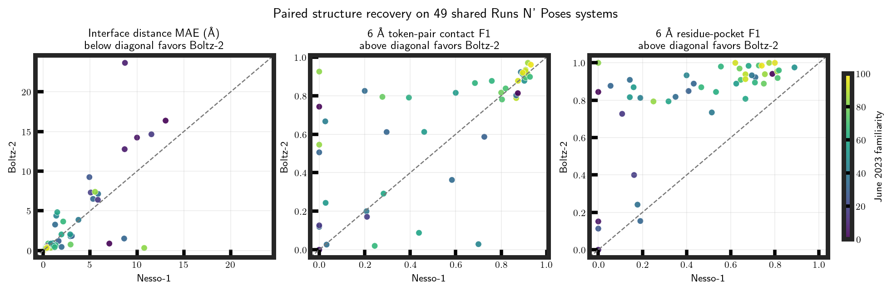
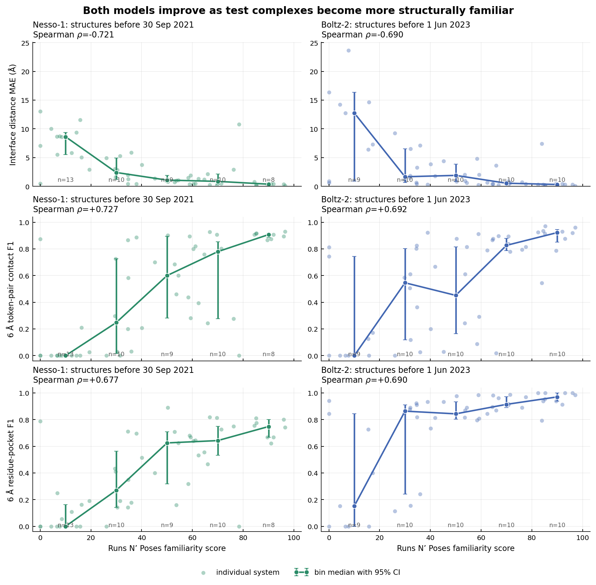

# Boltz-2 versus Nesso-1 on 50 post-cutoff Runs N’ Poses systems

## Result in one paragraph

Both models became markedly more accurate as the test complex became more
similar to structures available before that model's cutoff. On the 49 systems
completed by both models, Boltz-2 recovered the correct pocket much more
reliably: median 6 Å residue-pocket F1 was **0.889** versus **0.514** for Nesso-1, and
Boltz-2 was better on 44 systems, Nesso-1 on one, with four ties. Boltz-2 also
had higher median token-pair contact F1 (0.780 versus 0.462), although the median
paired improvement was small because performance was heterogeneous. There was
no consistent paired advantage in interface-distance MAE. Nesso-1 completed
50/50 systems and was about 3.6 times faster locally; Boltz-2 completed 49/50,
with one 818-residue system exceeding the 10 GiB GPU limit.

Each point is the same physical protein-ligand complex scored for both models.
Color is the Runs N’ Poses familiarity score against structures released before
1 June 2023. The diagonal is equality, so the favorable side changes according
to whether lower or higher values are better.

## What was tested

The frozen set contains 50 complexes released after 1 June 2023, with ten in
each Boltz-2 familiarity range (0–20, 20–40, 40–60, 60–80, and 80–100). It has
50 unique PDB entries, protein sequences, ligands, and Runs N’ Poses structural
clusters. Selection used neither model predictions nor experimental
coordinates.

Both models received the exact deposited protein construct sequence and a
stereochemical ligand SMILES. Boltz-2 additionally received a ColabFold MSA,
parsed to at most 8,192 sequences and stochastically subsampled to 1,024. The
experimental coordinates were withheld until scoring. This is a structure
benchmark, not an affinity benchmark: these 50 records do not share a uniform
experimental affinity endpoint.

## Shared structural metrics

The common distance token is the protein Cβ atom (Cα for glycine) paired with a
ligand heavy atom.

- **Interface distance MAE:** mean absolute error for resolved token pairs whose
  experimental distance is at most 15 Å. Lower is better.
- **Token-pair contact F1:** binary recovery of token pairs within 6 Å. Higher is
  better.
- **Residue-pocket F1:** recovery of protein residues whose experimental
  structure has any heavy atom within 6 Å of the ligand. Nesso-1 predicts the
  residue label from its representative-token distogram; Boltz-2 predicts it
  from its final all-heavy-atom coordinate model. Higher is better.

Nesso-1 predicts a probability distribution over distances; its expected
distance is used here. Boltz-2 produces one sampled coordinate set, from which
distances are measured directly. Thus these are the closest common readouts,
not identical model outputs. In particular, Boltz-2 predicts side-chain
coordinates, whereas the Nesso pocket call is inferred from token distances.

## Paired comparison

| Metric | Nesso-1 median | Boltz-2 median | Boltz-2 / Nesso-1 / ties | Mean paired improvement for Boltz-2 (95% bootstrap interval) |
| --- | ---: | ---: | ---: | ---: |
| Interface distance MAE (Å) | 1.387 | 0.881 | 22 / 27 / 0 | −0.371 (−1.314, 0.481) Å |
| 6 Å token-pair contact F1 | 0.462 | 0.780 | 27 / 16 / 6 | +0.095 (0.020, 0.172) |
| 6 Å residue-pocket F1 | 0.514 | 0.889 | 44 / 1 / 4 | +0.318 (0.251, 0.388) |

For the error metric, improvement is defined as Nesso-1 minus Boltz-2; for F1,
it is Boltz-2 minus Nesso-1. Positive therefore always favors Boltz-2. The
apparently lower Boltz-2 cohort median interface MAE should not be mistaken for
a consistent paired advantage: Nesso-1 was better on 27 of 49 systems, and the
paired mean and median intervals overlap zero.

Chemically equivalent ligand atom assignments are handled identically for both
models: distance MAE is minimized and contact F1 is maximized over exact
graph-symmetry mappings, with deterministic lexicographic tie-breaking.

## Dependence on structural familiarity

Familiarity is model-specific. Nesso-1 is compared with structures released
before 30 September 2021, whereas Boltz-2 is compared with structures released
before 1 June 2023. Spearman ρ asks whether systems preserve a monotonic ordering;
it does not require a linear relationship.

The two columns use the same accuracy scales but separate familiarity axes.
Faint points are individual systems. Connected points are medians in fixed
20-point familiarity bins; error bars are 95% bootstrap intervals, and each
bin's sample count is printed along the axis. The cohort was balanced by the
Boltz-2 score, so Nesso-1's earlier-cutoff bin counts are not exactly equal.

| Model and cutoff | Interface MAE ρ | Token-pair F1 ρ | Residue-pocket F1 ρ |
| --- | ---: | ---: | ---: |
| Nesso-1, Sep. 2021 (n=50) | −0.721 | +0.727 | +0.677 |
| Boltz-2, Jun. 2023 (n=49) | −0.690 | +0.692 | +0.690 |

All six 95% cluster-bootstrap intervals exclude zero. Higher familiarity is
therefore associated with lower distance error and better contact/pocket
recovery for both models in this selected cohort. This is an association, not
proof that memorization causes the improvement: protein family, ligand class,
structure quality, and other difficulty variables can covary with familiarity.

## What only Boltz-2 can be asked

Because Boltz-2 generates explicit coordinates, it can be scored by RMSD.
After a global Cα alignment of the predicted and experimental proteins, with no
ligand-only fitting, the median protein Cα RMSD was **0.894 Å** and median
symmetry-corrected ligand heavy-atom RMSD was **3.355 Å**. Ligand RMSD was below
2 Å for 22/49 systems (44.9%) and below 5 Å for 30/49 (61.2%). Nesso-1 does not
generate a coordinate model, so assigning it a ligand RMSD would be invalid.

## Completion and speed

| Model | Completed | Wall time | Seconds per attempted system |
| --- | ---: | ---: | ---: |
| Nesso-1 v1.0.0 | 50/50 | 326.1 s | 6.52 s |
| Boltz-2 v2.2.1, MSA-1024 | 49/50 | 1181.7 s | 23.63 s |

These are batched local wall times on the same RTX 3080, including each model's
local preprocessing and inference. Boltz's external ColabFold MSA search time is
excluded, so this is not a complete end-to-end latency comparison. Nesso's
protein ESM-2 embedding step is included. The Boltz/Nesso time ratio was 3.62.

Boltz-2's sole model failure was `8uk6__1__1.A__1.C__1.C`, whose protein has 818
residues. It ran out of memory under the frozen 1,024-sequence MSA subsample.
The failure is retained rather than rerun under a post-hoc lower-MSA protocol.

## Interpretation and limits

The most defensible conclusion is not that one model is universally superior.
Boltz-2's explicit coordinate generation gives substantially better pocket
recovery and enables pose RMSD, but at higher cost and with one local hardware
failure. Nesso-1 is faster and its interface-distance errors are competitive,
but it does not return a complete 3D complex.

This is a one-seed, one-sample-per-system study. The set was balanced using
Boltz-2's June-2023 familiarity, not Nesso-1's earlier cutoff. MSA-1024 is a
hardware-constrained Boltz protocol. No claim about affinity accuracy follows
from this experiment. A stronger follow-up would repeat Boltz diffusion seeds,
predefine how multiple samples are ranked, and evaluate uncertainty calibration
without changing the frozen 50-system selection.

## Reproducibility

- Frozen manifest: [`data/manifests/rnp_boltz2_nesso1_postcutoff50.json`](../../data/manifests/rnp_boltz2_nesso1_postcutoff50.json), SHA-256 `ac98b0d4a0a632d4643beb8d999de59b2c8561c31538ab6565e95b145312e5ed`.
- Experiment: [`experiments/exp015_boltz2_nesso1_rnp_postcutoff50/`](../../experiments/exp015_boltz2_nesso1_rnp_postcutoff50/).
- Machine-readable summary: [`results/summary.json`](results/summary.json).
- Paired table: [`results/paired_metrics.csv`](results/paired_metrics.csv).
- Familiarity-bin table: [`results/familiarity_binned_metrics.csv`](results/familiarity_binned_metrics.csv).
- Analysis scripts: [`scripts/analyze_nesso_rnp_distograms.py`](../../scripts/analyze_nesso_rnp_distograms.py), [`scripts/analyze_boltz2_rnp_structures.py`](../../scripts/analyze_boltz2_rnp_structures.py), and [`scripts/compare_rnp_paired_models.py`](../../scripts/compare_rnp_paired_models.py).
